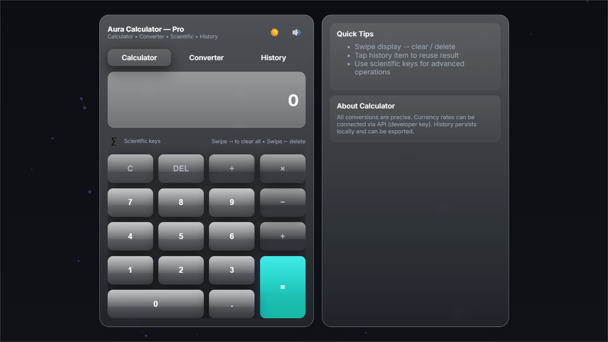
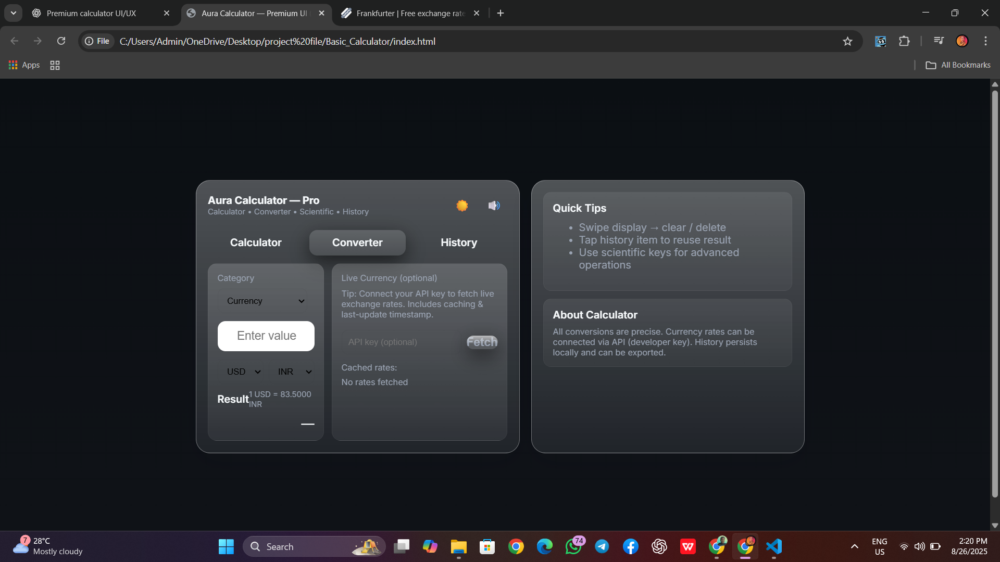

Sahi bola bhai 🔥
Live demo ka section add kar dete hain taaki GitHub pe dekhne wale log direct demo run kar saken.

Ye updated `README.md` ready hai:

---

# 📘 README.md (Aura Calculator — Pro UI)

```markdown
# ⚡ Aura Calculator — Pro UI

A modern, responsive, and premium-style **Calculator Web App** with multiple modes (Standard & Converter).  
Designed with **clean UI/UX principles**, mobile responsiveness, and smooth interactions.

---

## 🚀 Features

- 🔢 **Standard Calculator** — Basic arithmetic operations.  
- 🔄 **Unit Converter** — Convert between different units with ease.  
- 🎨 **Premium UI** — Modern, glassmorphism-inspired design.  
- 📱 **Responsive Layout** — Works seamlessly on desktop and mobile.  
- 🌙 **Dark/Light Mode Ready** (easy theme customization).  
- ⚡ **Fast & Lightweight** — Pure HTML, CSS, and JavaScript (no heavy frameworks).  

---

## 🖼️ Preview

  
 

---

## 🌍 Live Demo

Try it out here: 👉 [Live Demo](https://nitesh-shaw-098.github.io/Aura-calculator/)  

*(Update the above link with your GitHub Pages URL after deployment)*  

---

## 📂 Project Structure

```

Aura-Calculator/
│── index.html      # Main calculator UI
│── style.css       # Styling & themes
│── script.js       # Functionality
│── preview\.png     # Screenshot (optional)
└── README.md       # Project documentation

````

---

## 🛠️ Technologies Used

- **HTML5** — Structure  
- **CSS3** — Styling (Glassmorphism + Responsive Design)  
- **JavaScript (ES6)** — Logic & Interactions  

---

## ⚡ Getting Started

1. Clone the repository:

   ```bash
   git clone https://github.com/your-username/Aura-calculator.git
````

2. Open the project folder:

   ```bash
   cd aura-calculator
   ```

3. Run the project:

   * Simply open `index.html` in your browser 🚀
   * No extra setup required.

---

## 🌟 Future Enhancements

* Add more converters (currency, temperature, etc.).
* Add history & memory functions.
* Implement scientific calculator mode.
* Improve animations with GSAP/Framer Motion.

---

## 🤝 Contributing

Contributions are always welcome!
If you’d like to improve the project, fork it and create a pull request.

---

## 📜 License

This project is **open-source** and available under the [MIT License](LICENSE).

---

### 👨‍💻 Author

Made with ❤️ by [Your Name](https://github.com/nitesh-shaw-098)

```

